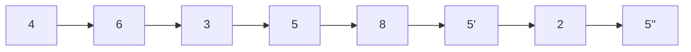
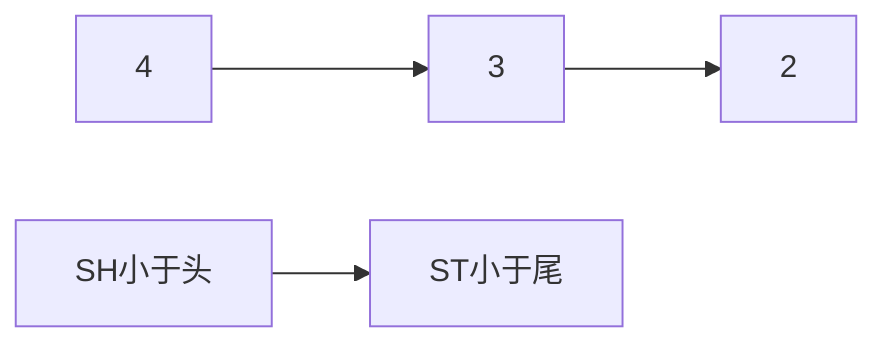
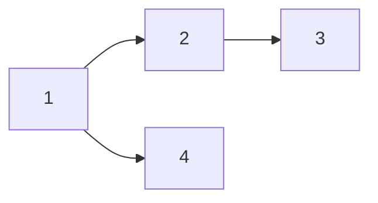
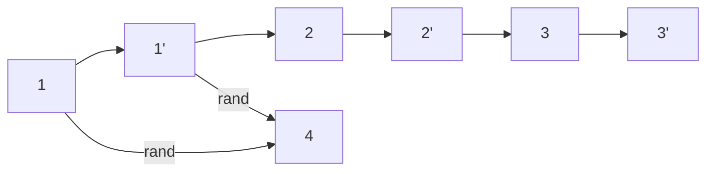

# 【链表】

## P6 链表

### 1、哈希表的简单介绍

> 1）哈希表在使用层面上可以理解为一个集合结构
>
> 2）如果只有key，没有伴随数据value，可以使用HashSet结构（C++中叫unorderedset）
>
> 3）如果既有key，又有伴随数据value，可以使用HashMap结构（C++中叫unorderedmap）
>
> 4）有无伴随数据，是HashMap和HashSet唯一的区别，底层的实际结构是一回事
>
> 5）使用哈希表增（put）、删（remove）、改（put）和查（get）的操作，可以认为时间复杂度为O(1)，但是常数时间比较大
>
> 6）放入哈希表的东西，如果是基础类型，内部按值传递，内存占用就是这个东西的大小
>
> 7）放入哈希表的东西，如果不是基础类型，内部按引用传递，内存占用是这个东西内存地址的大小

### 2、有序表的简单介绍

> 1）有序表在使用层面上可以理解为一个集合结构
>
> 2）如果只有key，没有伴随数据value，可以使用TreeSet结构（C++中叫orderedset）
>
> 3）如果既有key，又有伴随数据value，可以使用TreeMap结构（C++中叫orderedmap）
>
> 4）有无伴随数据，是TreeSet和TreeMap唯一的区别，底层的实际结构是一回事
>
> 5）有序表和哈希表的区别是，有序表把key按照顺序组织起来，而哈希表完全不组织
>
> 6）红黑树、AVL树、size-balance-tree和跳表等都属于有序表结构，只是底层具体实现不同
>
> 6）放入哈希表的东西，如果是基础类型，内部按值传递，内存占用就是这个东西的大小
>
> 7）放入哈希表的东西，如果不是基础类型，**必须提供比较器**，内部按引用传递，内存占用是这个东西内存地址的大小
>
> 8）不管是什么底层具体实现，只要是有序表，都有以下固定的基本功能和固定的时间复杂度
>
> 9）增删改查，O(logN)级别时间复杂度，N为有序表含有的记录数。 

### 3、链表的节点结构

```c++
class Node<V>{
    V value;
    Node next;
}
```

由以上结构的节点依次连接起来所形成的链叫**单链表结构**。

```c++
class Node<V>{
    V value;
    Node next;
    Node last;
}
```

由以上结构的节点依次连接起来所形成的链叫**双链表结构**。

单链表和双链表结构只需要给定一个头部节点head，就可以找到剩下的所有的节点。

### 4、示例题

#### 1）题1-反转链表

分别实现反转单向链表和双向链表的函数，链表长度为N，时间复杂度要求为O(N)，额外空间复杂度要求为O(1)。 

#### 2）题2-打印两个链表的公共部分

给定两个有序链表的头指针head1和head2，打印两个链表的公共部分。两个链表的长度之和为N，时间复杂度要求为O(N)，额外空间复杂度要求为O(1)。 

#### 3）题3-判断一个链表是否为回文结构 

给定一个单链表的头节点head，请判断该链表是否为回文结构。例子：1->2->1，返回true；1->2->2->1，返回true。链表长度为N，时间复杂度要求为O(N)，额外空间复杂度要求为O(1)。  

> - 笔试做法：申请一个栈，遍历一次入栈，再遍历一次跟出栈的每个元素一一对比，若全部相等则为回文结构。
>
> - 笔试改进做法：申请的栈只保存后半部分数据，使用快慢指针来获取中点位置。（快指针一次走2步，慢指针一次走1不，快指针走到最后的时候，慢指针即为后半部分的开始，需要区分链表长度是奇偶数）
> - **进阶做法**：不用额外申请栈。快慢指针获取中点位置 -> 中点位置往下遍历的时候逆序 -> 引用记住首位位置A、B -> A、B开始遍历，逐元素比对 -> 比对完成后还原原链表。

#### 4）题4-将单向链表按某值划分成左边小、中间相等、右边大的形式。且保证原有相对顺序。

>  做法：定义6个变量：SH，ST，EH，ET，BH，BT。假设5为分割值。
>
> - 遍历过程中不断刷新6个变量
>
> - 最后：小于头 --> 小于尾 --> 等于头 --> 等于尾 --> 大于头 --> 大于尾，相连即为结果。





#### 5）题5-复制含有随机指针节点的链表

```C++
class Node {
    int value;
    Node next;
    Node rand;
    Node(int val) {
        value = val;
    }
}
```

> - 简单做法：用哈希表存老节点和克隆节点。
>
> - 进阶做法：遍历一次链表，1->2->3，克隆成1->1'->2->2'->3->3'。然后再遍历一遍，将1'的rand节点指向1的rand节点，最后再断开原有链表链接。





#### 6）题6-两个单链表相交的一系列问题

给定两个可能有环也可能无环的单链表，头节点head1和head2。请实现一个函数，如果两个链表相交，请返回相交的第一个节点。如果不相交，返回null。要求：两个链表长度之和为N，时间复杂度打到O(N)，额外空间复杂度请达到O(1)。


> **【注】单链表只有一个next指针！**
>
> 
>
> - Ⅰ、实现一个函数判断链表有无环，如果有环则返回第一个环节点。
>
>   - 简单实现方法：哈希表(set)。
>   - 进阶实现方法：快慢指针。（快指针走2步，慢指针走1步 -> 在某处相遇后，快指针回到头节点，再次出发和慢指针一样每次走1步 -> 最后快慢指针再次相遇的位置即为环入口节点 3）
>
>   ```mermaid
>   graph LR
>   1 --> 2 --> 3 --> 4 --> 5 --> 6 --> 7 --> 3
>   ```
>
>   
>
> - Ⅱ、若两个链表都无环
>
>   - 1）两个链表不相交。
>
>   - 2）两个链表相交。（从相交位置开始到最后必定都是公共部分！因为单链表只有一个next指针）
>
>   ```mermaid
>   graph LR
>   1 --> 2 --> 3 --> 4 --> 5 --> 6
>   a --> b --> c --> 3
>   ```
>
>   
>
> - Ⅲ、若一个有环链表，一个无环链表，则两个链表必定不相交。
>
> - Ⅳ、若两个都是有环链表
>
>   - 1）两个链表不相交。 -- 链表A的入环节点绕一圈后，无法遇到链表B的入环节点。
>
>   ```mermaid
>   graph LR
>   1 --> 2 --> 3 --> 4 --> 5 --> 6 --> 3
>   a --> b --> c --> d --> e --> f --> c
>   ```
>   
>   - 2）两个链表共用环，且入环节点相同。-- 链表A的入环节点与链表B的入环节点相等。
>   
>     **可复用Ⅱ中2）方法取两个链表差值来遍历链表获取第一个相交节点d。**（先遍历一遍获取环节点入口3 -> 进而获取到2个链表的长度len1、len2 -> 基于链表长度差值 |len1 - len2| 去分别遍历，第一次相遇点即为第一个相交节点）
>   
>   ```mermaid
>   graph LR
>   1 --> 2 --> d --> e --> 3 --> 4 --> 5 --> 6 --> 3
>   a --> b --> c --> d
>   ```
>   
>   - 3）两个链表共用环，但入环节点不相同。-- 链表A的入环节点绕一圈后，能遇到链表B的入环节点。
>   
>   ```mermaid
>   graph LR
>   1 --> 2 --> 3 --> 4 --> 5 --> 6 --> 3
>   a --> b --> 5
>   ```
>   
>   

### 5、 链表解题方法论

> - 笔试时不用太在乎空间复杂度，一切为了时间复杂度；
>
> - 面试时时间复杂度放在第一位，但也要找到空间最省的方法；
>
> 【重要技巧】
>
> - 额外数据结构记录（哈希表等）
>
> - 快慢指针