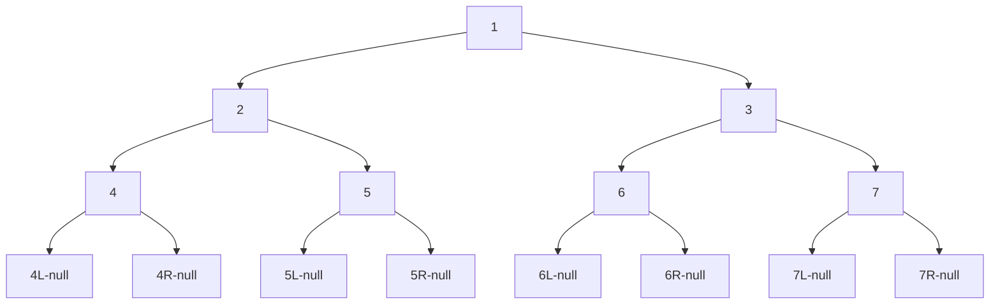

# 【二叉树】

## P7 二叉树

### 1、二叉树的遍历

二叉树节点结构

```C++
class Node<V> {
    V value;
    Node left;
    Node right;
}
```

用递归和非递归两种方式实现二叉树的先序、中序、后序遍历

#### 1）递归序遍历

遍历会回到每个节点三次。（一开始遍历到、左孩子遍历完返回、右孩子遍历完返回）

```C++
// 递归序
void Recur(TreeNode *head) {
    if (head == nullptr) {
        return;
    }
    // 第1次来到head节点
    Recur(head->left);
    // 第2次来到head节点
    Recur(head->right);
    // 第3次来到head节点
}
```



- 递归序结果：1 - 2 - 4 - 4 - 4 - 2 - 5 - 5 - 5 - 2 - 1 - 3 - 6 - 6 - 6 - 3 - 7 - 7 - 7 - 3 - 1

#### 2）先序遍历

对于所有子树来说，打印顺序：头节点->左子树所有节点->右子树所有节点。

- 根左右

- 先序遍历结果：1，2，4，5，3，6，7

> - 递归实现：在递归序中第1次遍历到该节点时，进行处理。
>
> - 非递归实现：
>   - a）从栈中弹出一个节点cur；
>   - b）处理cur节点；
>   - c）如果cur节点有孩子节点，先右孩子再左孩子（如果有的话）压入栈；
>   - d）周而复始以上过程。

```C++
// 先序遍历-递归版
void PreOrderRecur(TreeNode *head) {
    if (head == nullptr) {
        return;
    }
    std::cout << head->val << " ";
    PreOrderRecur(head->left);
    PreOrderRecur(head->right);
}

// 先序遍历-非递归版
void PreOrderUnRecur(TreeNode *treeNode) {
    if (treeNode == nullptr) {
        return;
    }
    std::stack<TreeNode *> s;
    s.push(treeNode);
    while (!s.empty()) {
        TreeNode *cur = s.top();
        s.pop();
        std::cout << cur->val << " ";
        if (cur->right) {
            s.push(cur->right);
        }
        if (cur->left) {
            s.push(cur->left);
        }
    }
}
```

#### 3）中序遍历

对于所有子树来说，打印顺序：左子树所有节点->头节点->右子树所有节点。

- 左根右

- 中序遍历结果：4，2，5，1，6，3，7

> - 递归实现：在递归序中第2次遍历到该节点时，进行处理。
>
> - 非递归实现：
>
>   - a）**每棵子树整棵树左边界全部进栈；** （出栈就变成左-根）
>
>   - b）依次弹出节点cur，进行处理；**并对弹出的节点的右子树全部进栈；**（出栈结果在a基础上变成左-根-右）
>
>     【注】右子树中途如果某个节点有左子树，继续压左边界。总而言之一直压左树，左没了就压右树。
>
>   - c）重复步骤a）、b）。

```C++
// 中序遍历-递归版
void InOrderRecur(TreeNode *head) {
    if (head == nullptr) {
        return;
    }
    InOrderRecur(head->left);
    std::cout << head->val << " ";
    InOrderRecur(head->right);
}

// 中序遍历-非递归版
void InOrderUnRecur(TreeNode *treeNode) {
    if (treeNode == nullptr) {
        return;
    }
    std::stack<TreeNode *> s;
//    s.push(treeNode);
    while (!s.empty() || treeNode != nullptr) {
        if (treeNode) { // 注意判断条件是node自身
            s.push(treeNode);
            treeNode = treeNode->left;
        } else {
            treeNode = s.top();
            s.pop();
            std::cout << treeNode->val << " ";
            treeNode = treeNode->right;
        }
    }
}
```

#### 4）后序遍历

对于所有子树来说，打印顺序：左子树所有节点->右子树所有节点->头节点。

- 左右根  

- 后序遍历结果：4，5，2，6，7，3，1

> - 递归实现：在递归序中第3次遍历到该节点时，进行处理。
>
> - 非递归实现1：
>
>   - a）从栈中弹出一个节点cur；
>
>   - b）处理cur节点，放入到辅助栈中；
>
>   - c）如果cur节点有孩子节点，先左孩子再右孩子（如果有的话），压入栈；
>
>   - d）周而复始以上过程；
>
>   - e）辅助栈的入栈顺序为根-右-左，再依次从辅助栈出栈，即为后序遍历结果（左-右-根）
>
>     1，3，7，6，2，5，4  --> 4，5，2，6，7，3，1

```C++
// 后序遍历-递归版
void PosOrderRecur(TreeNode *head) {
    if (head == nullptr) {
        return;
    }
    PosOrderRecur(head->left);
    PosOrderRecur(head->right);
    std::cout << head->val << " ";
}

// 后序遍历-非递归版
void PosOrderUnRecur(TreeNode *treeNode) {
    if (treeNode == nullptr) {
        return;
    }
    std::stack<TreeNode *> s;
    std::stack<TreeNode *> sHelper;
    s.push(treeNode);
    while (!s.empty()) {
        TreeNode *cur = s.top();
        s.pop();
        sHelper.push(cur);
        if (cur->left) {
            s.push(cur->left);
        }
        if (cur->right) {
            s.push(cur->right);
        }
    }

    while (!sHelper.empty()) {
        std::cout << sHelper.top()->val << " ";
        sHelper.pop();
    }
}
```

### 2、示例题

#### 1）题1-如何直观的打印一棵二叉树

#### 2）题2-如何完成二叉树的宽度优先遍历

- 常见题目：求一颗二叉树的宽度。 解法：使用宽度优先遍历

- 二叉树的深度优先遍历（DFS）就是先序遍历。

```C++
// 宽度优先遍历(层序遍历)
void WFS(TreeNode *treeNode) {
    if (treeNode == nullptr) {
        return;
    }
    std::queue<TreeNode *> q;
    q.push(treeNode);
    while (!q.empty()) {
        TreeNode *cur = q.front();
        std::cout << cur->val << " ";
        q.pop();
        if (cur->left) {
            q.push(cur->left);
        }
        if (cur->right) {
            q.push(cur->right);
        }
    }
}
```

