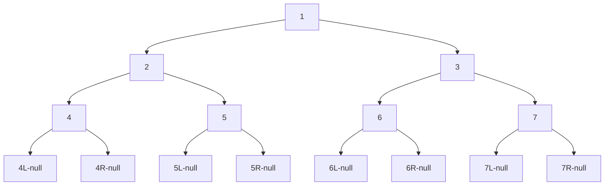

# 【二叉树】

## P7 二叉树

### 概念小结：

- 1）先序遍历：根左右；中序遍历：左根右；后序遍历：左右根。

- 2）搜索二叉树：每棵子树的左子树（所有节点）都比根节点小，右子树（所有节点）都比根节点大。

- 3）完全二叉树：满二叉树 or 只有最后一层没满且没满的是右子树（左侧是满的）。

- 4）满二叉树：最大深度L，节点数N，N = 2 ^ L - 1。
- 5）平衡二叉树：对于任何一个子树，左树的高度和右树的高度差不超过1。

### 1、二叉树的遍历

二叉树节点结构

```C++
class Node<V> {
    V value;
    Node left;
    Node right;
}
```

用递归和非递归两种方式实现二叉树的先序、中序、后序遍历

#### 1）递归序遍历

遍历会回到每个节点三次。（一开始遍历到、左孩子遍历完返回、右孩子遍历完返回）

```C++
// 递归序
void Recur(TreeNode *head) {
    if (head == nullptr) {
        return;
    }
    // 第1次来到head节点
    Recur(head->left);
    // 第2次来到head节点
    Recur(head->right);
    // 第3次来到head节点
}
```



- 递归序结果：1 - 2 - 4 - 4 - 4 - 2 - 5 - 5 - 5 - 2 - 1 - 3 - 6 - 6 - 6 - 3 - 7 - 7 - 7 - 3 - 1

#### 2）先序遍历

对于所有子树来说，打印顺序：头节点->左子树所有节点->右子树所有节点。

- 根左右

- 先序遍历结果：1，2，4，5，3，6，7

> - 递归实现：在递归序中第1次遍历到该节点时，进行处理。
>
> - 非递归实现：
>   - a）从栈中弹出一个节点cur；
>   - b）处理cur节点；
>   - c）如果cur节点有孩子节点，先右孩子再左孩子（如果有的话）压入栈；
>   - d）周而复始以上过程。

```C++
// 先序遍历-递归版
void PreOrderRecur(TreeNode *head) {
    if (head == nullptr) {
        return;
    }
    std::cout << head->val << " ";
    PreOrderRecur(head->left);
    PreOrderRecur(head->right);
}

// 先序遍历-非递归版
void PreOrderUnRecur(TreeNode *treeNode) {
    if (treeNode == nullptr) {
        return;
    }
    std::stack<TreeNode *> s;
    s.push(treeNode);
    while (!s.empty()) {
        TreeNode *cur = s.top();
        s.pop();
        std::cout << cur->val << " ";
        if (cur->right) {
            s.push(cur->right);
        }
        if (cur->left) {
            s.push(cur->left);
        }
    }
}
```

#### 3）中序遍历

对于所有子树来说，打印顺序：左子树所有节点->头节点->右子树所有节点。

- 左根右

- 中序遍历结果：4，2，5，1，6，3，7

> - 递归实现：在递归序中第2次遍历到该节点时，进行处理。
>
> - 非递归实现：
>
>   - a）**每棵子树整棵树左边界全部进栈；** （出栈就变成左-根）
>
>   - b）依次弹出节点cur，进行处理；**并对弹出的节点的右子树全部进栈；**（出栈结果在a基础上变成左-根-右）
>
>     【注】右子树中途如果某个节点有左子树，继续压左边界。总而言之一直压左树，左没了就压右树。
>
>   - c）重复步骤a）、b）。

```C++
// 中序遍历-递归版
void InOrderRecur(TreeNode *head) {
    if (head == nullptr) {
        return;
    }
    InOrderRecur(head->left);
    std::cout << head->val << " ";
    InOrderRecur(head->right);
}

// 中序遍历-非递归版
void InOrderUnRecur(TreeNode *treeNode) {
    if (treeNode == nullptr) {
        return;
    }
    std::stack<TreeNode *> s;
//    s.push(treeNode);
    while (!s.empty() || treeNode != nullptr) {
        if (treeNode) { // 注意判断条件是node自身
            s.push(treeNode);
            treeNode = treeNode->left;
        } else {
            treeNode = s.top();
            s.pop();
            std::cout << treeNode->val << " ";
            treeNode = treeNode->right;
        }
    }
}
```

#### 4）后序遍历

对于所有子树来说，打印顺序：左子树所有节点->右子树所有节点->头节点。

- 左右根  

- 后序遍历结果：4，5，2，6，7，3，1

> - 递归实现：在递归序中第3次遍历到该节点时，进行处理。
>
> - 非递归实现1：
>
>   - a）从栈中弹出一个节点cur；
>
>   - b）处理cur节点，放入到辅助栈中；
>
>   - c）如果cur节点有孩子节点，先左孩子再右孩子（如果有的话），压入栈；
>
>   - d）周而复始以上过程；
>
>   - e）辅助栈的入栈顺序为根-右-左，再依次从辅助栈出栈，即为后序遍历结果（左-右-根）
>
>     1，3，7，6，2，5，4  --> 4，5，2，6，7，3，1

```C++
// 后序遍历-递归版
void PosOrderRecur(TreeNode *head) {
    if (head == nullptr) {
        return;
    }
    PosOrderRecur(head->left);
    PosOrderRecur(head->right);
    std::cout << head->val << " ";
}

// 后序遍历-非递归版
void PosOrderUnRecur(TreeNode *treeNode) {
    if (treeNode == nullptr) {
        return;
    }
    std::stack<TreeNode *> s;
    std::stack<TreeNode *> sHelper;
    s.push(treeNode);
    while (!s.empty()) {
        TreeNode *cur = s.top();
        s.pop();
        sHelper.push(cur);
        if (cur->left) {
            s.push(cur->left);
        }
        if (cur->right) {
            s.push(cur->right);
        }
    }

    while (!sHelper.empty()) {
        std::cout << sHelper.top()->val << " ";
        sHelper.pop();
    }
}
```

### 2、示例题

#### 1）题1-如何直观的打印一棵二叉树

#### 2）题2-如何完成二叉树的宽度优先遍历

- 常见题目：求一颗二叉树的宽度。 解法：使用宽度优先遍历

- 二叉树的深度优先遍历（DFS）就是先序遍历。

```C++
// 宽度优先遍历(层序遍历)
void WFS(TreeNode *treeNode) {
    if (treeNode == nullptr) {
        return;
    }
    std::queue<TreeNode *> q;
    q.push(treeNode);
    while (!q.empty()) {
        TreeNode *cur = q.front();
        std::cout << cur->val << " ";
        q.pop();
        if (cur->left) {
            q.push(cur->left);
        }
        if (cur->right) {
            q.push(cur->right);
        }
    }
}
```

#### 3）题3-给定两个二叉树的节点node1和node2，找到它们的最低公共祖先节点

> - 解法一：先递归方式建立HashMap（存每个节点的父节点），再去查找。
>
> - 解法二：递归。
>
>   - 1）情况1 node1是node2的最低公共祖先，或者node2是node1的最低公共祖先。
>
>   - 2）情况2 情况1之外的所有情况。需要向上才能找到。

```C++
// 获取两个节点的最小公共祖先
TreeNode *GetLowestAncestor(TreeNode *head, TreeNode *node1, TreeNode *node2) {
    // base case
    if (head == nullptr || head == node1 || head == node2) {
        return head;
    }
    // 找左孩子和右孩子要答案
    TreeNode *left = GetLowestAncestor(head->left, node1, node2);
    TreeNode *right = GetLowestAncestor(head->right, node1, node2);
    // 如果一个子树既没有node1也没有node2一定会返回空
    // 如果一个子树左和右都有返回值，就是最小公共祖先
    if (left == nullptr && right == nullptr) {
        return head;
    }
    return left != nullptr ? left : right;
}
```


### 3、二叉树的相关概念及其实现判断

### 二叉树解题套路：（树型DP）

- 1）开始条件，不满足直接返回；

- 2）左右信息递归；（定义好信息结构体，希望左子树返回什么信息，右子树返回什么信息）

- 3）最终返回值。（**如何利用左、右子树返回的信息加工组合**，得到最终的返回结果）

#### 1）如何判断一棵二叉树是否是搜索二叉树（BST）

- 搜索二叉树：每棵子树的左子树（所有节点）都比根节点小，右子树（所有节点）都比根节点大。
- 解法：中序遍历（左根右），（处理时判断一下当前处理值是否比上一个处理值大）如果结果都是升序的，就是搜索二叉树。

```C++
int preVal = INT_MIN; // 全局变量

// 判断是否搜索二叉树
bool isBST(TreeNode *head) {
    if (head == nullptr) {
        return true;
    }
    bool isLeftBST = isBST(head->left);
    if (!isLeftBST) {
        return false;
    }
    if (head->val <= preVal) { // 搜索二叉树没有重复大小值的节点
        return false;
    } else {
        preVal = head->val;
    }
    return isBST(head->right);
}
```

#### 2）如何判断一棵二叉树是完全二叉树

- 完全二叉树：满二叉树 or 只有最后一层没满且没满的是右子树（左侧是满的）。
- 解法：宽度优先遍历（层序遍历）。
  - a）遍历过程中，任何一个节点有右孩子但是没有左孩子，就返回false。
  - b）在a条件满足的情况下，如果遇到了第一个左右孩子不全的节点，那么后续节点都是叶子节点。

```C++
bool isCBT(TreeNode *head) {
    if (head == nullptr) {
        return true;
    }
    // 是否遇到过左右两个孩子不双全的节点
    bool isLeaf = false;
    std::queue<TreeNode *> q;
    q.push(head);
    while (!q.empty()) {
        head = q.front();
        q.pop();
        TreeNode *left = head->left;
        TreeNode *right = head->right;
        // 有右孩子没有左孩子
        if (left == nullptr && right != nullptr) {
            return false;
        }
        // 遇到了第一个左右孩子不全的节点，后续节点不是叶子节点。
        if (isLeaf && (left != nullptr || right != nullptr)) {
            return false;
        }
        if (left) {
            q.push(left);
        }
        if (right) {
            q.push(right);
        }
        // 第一个左右孩子不双全的节点
        if (left == nullptr || right == nullptr) {
            isLeaf = true;
        }
    }
    return true;
}
```

#### 3）如何判断一棵二叉树是否是满二叉树

- 满二叉树：最大深度L，节点数N，N = 2 ^ L - 1。

```C++
class Info {
public:
    Info(int h, int n) : height(h), nodes(n) {}

    int height{0};
    int nodes{0};
};

Info isFBTProcess(TreeNode *head) {
    if (head == nullptr) {
        return Info(0, 0);
    }
    Info leftData = isFBTProcess(head->left);
    Info rightData = isFBTProcess(head->right);
    int height = std::max(leftData.height, rightData.height) + 1;
    int nodes = leftData.nodes + rightData.nodes + 1;
    return Info(height, nodes);
}

// 是否满二叉树
bool isFBT(TreeNode *head) {
    Info info = isFBTProcess(head);
    return info.nodes == (1 << info.height) - 1;
}
```

#### 4）如何判断一棵二叉树是否是平衡二叉树

- 平衡二叉树： 对于任何一个子树，左树的高度和右树的高度差不超过1。

- 解法：

  1）左子树是平衡二叉树；

  2）右子树是平衡二叉树；

  3）当前根节点的左树高度和右树高度差不超过1。

