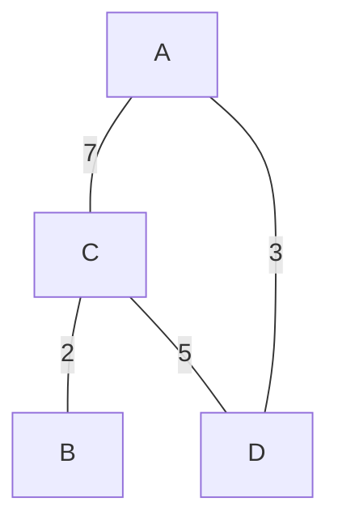
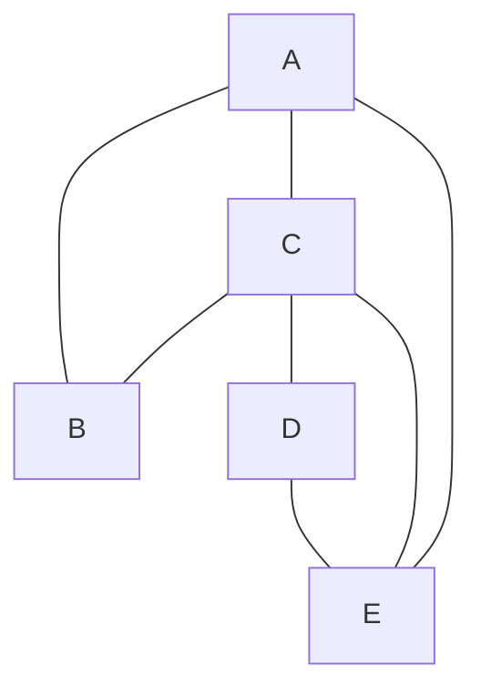

# 【图】

## P8 P9 图

### 1、图的相关概念

#### 1）图由点集和边集组成

#### 2）有向图和无向图

#### 3）图的存储方式

也支持带权值的图。

- 邻接表 （以点集为单位，直接邻居写在后面，间接邻居不管）

  A： C，D

  B： C

  C： A，B，D

  D： A，C

- 邻接矩阵

  |      | A    | B    | C    | D    |
  | ---- | ---- | ---- | ---- | ---- |
  | A    | 0    | ∞    | 7    | 3    |
  | B    | ∞    | 0    | 2    | ∞    |
  | C    | 7    | 2    | 0    | 5    |
  | D    | 3    | ∞    | 5    | 0    |

如何表达图？生成图？

表达图的方式还有很多，比如一些特殊的图也可以用数组表示。

【注】图这类题的难点在于，**对应每道题用图表达的方式不同，要对相应的表达方式实现相关的图算法**。一种比较好的处理方式：**将图表达方式转换成自己熟悉的表达方式，进而使用熟悉的图表达方式的算法（自己已经比较熟悉的模板）**。

#### 4）图的数据结构实现和模板化

### 2、图的遍历

#### 1）图的宽度优先遍历

> - 利用队列实现
> - 从源节点开始依次按照宽度进队列，然后弹出
> - 每弹出一个点，把该节点**所有**没有进过队列的邻接点放入队列
> - 直到队列变空

#### 2）图的广度优先遍历

> - 利用栈实现
> - 从源节点开始把节点按照深度放入栈，然后弹出
> - 每弹出一个点，把该节点**下一个**没有进过栈的邻接点放入栈
> - 直到栈变空

BFS的一种结果：A B C E D

DFS的一种结果：A B C D E